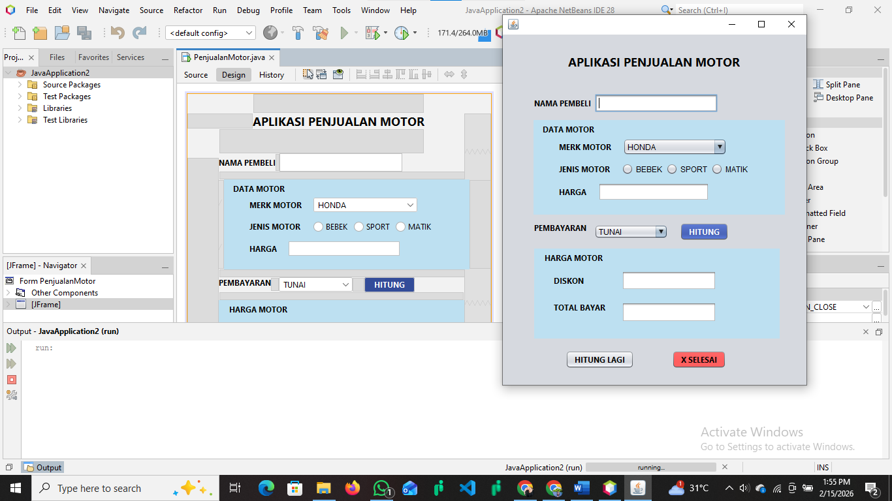

# 🚀 PERANCANGAN-DAN-IMPLEMENTASI-APLIKASI-PENJUALAN-MOTOR-BERBASIS-DESKTOP-MENGGUNAKAN-JAVA
## 📌 Deskripsi
Aplikasi ini dibuat untuk memenuhi tugas Ujian Akhir Semester (UAS) 
mata kuliah Pemrograman Berorientasi Objek (PBO).

Aplikasi ini berfungsi untuk membantu proses transaksi penjualan motor 
dengan perhitungan diskon dan total pembayaran secara otomatis 
menggunakan konsep Object Oriented Programming (OOP).

---

## ✨ Fitur Aplikasi
- Input data pembeli
- Input data motor
- Perhitungan diskon otomatis
- Perhitungan total bayar
- Tombol Hitung dan Reset

---

## 🛠 Teknologi yang Digunakan
- Java
- NetBeans IDE
- Konsep OOP (Class, Object, Method, Encapsulation)

---

## 🖥 Tampilan Aplikasi

---

## ▶ Cara Menjalankan
1. Buka project di NetBeans
2. Klik Run Project
3. Masukkan data pembeli dan motor
4. Klik tombol Hitung

---

## 👨‍💻 Dibuat Oleh
**Agesta Ari Nugraha**
